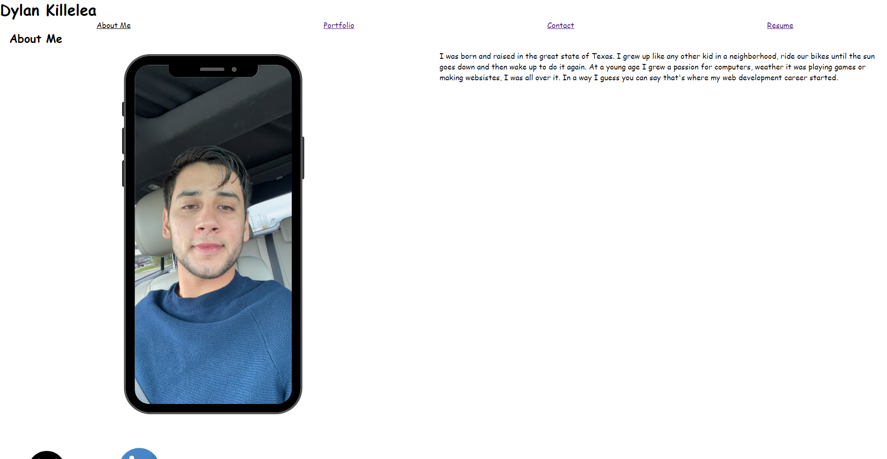
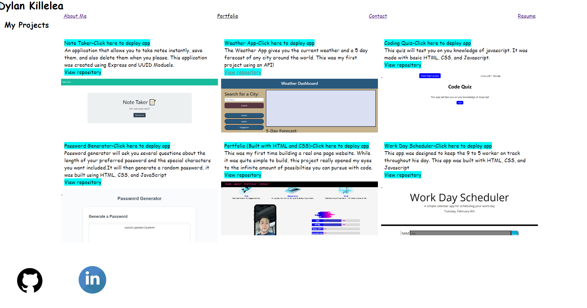
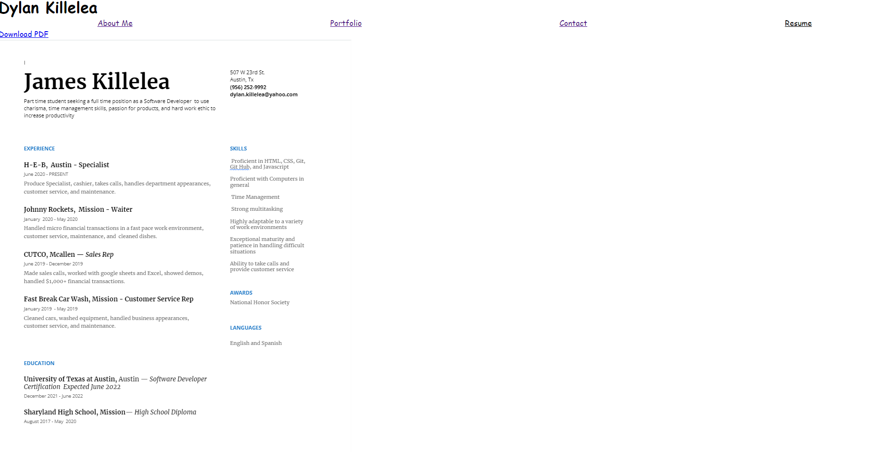

# Portfolio made with React
This Portfolio page was made using React, therefore the user is only ever on one page. This was a great learning experience and I can't wait to do more with React.

## Installation
Simply download the repo, from the root directory run "npm i" to install all dependencies, and finally run "npm start" to deploy the app.

## Screenshots

## Contribution 
Made with ❤️ by James Killelea